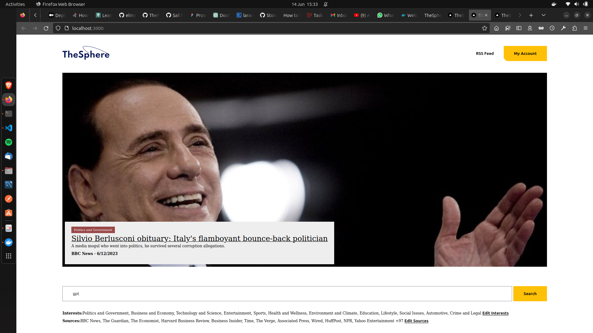
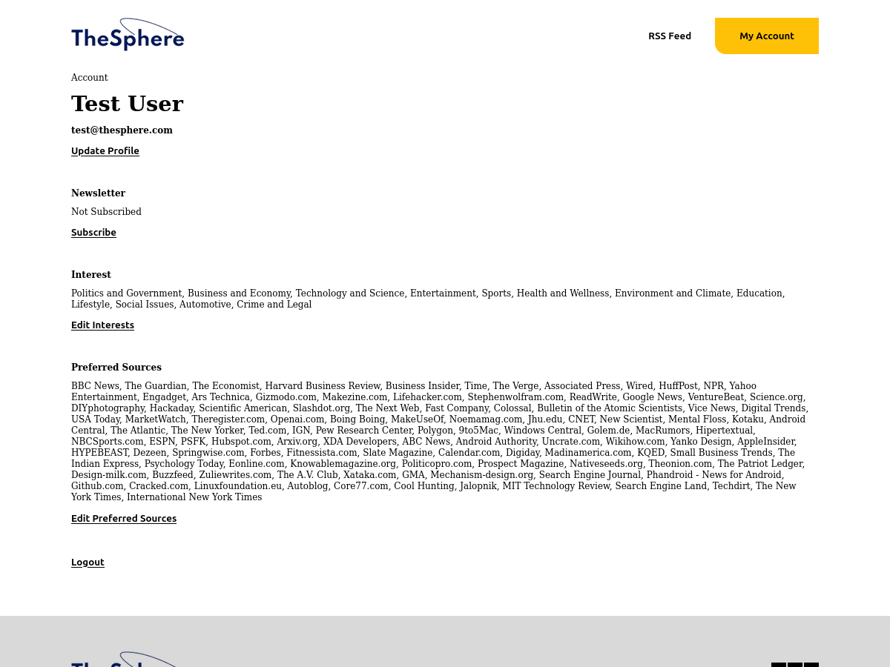

# TheSphere - Innoscripta Assessment

A news Aggregator with Laravel-MySQl based Backend. See requirement documeent [here](<Take-Home_Challenge_FullStack new.pdf>).

## UI Design
Here is the Figma Sketch used for the UI planning [here](https://www.figma.com/file/mi5aE68bXfPFJPYW0tlEnU/Prosup?type=design&node-id=304%3A10&t=U6J0c5Zxx8hRynu5-1)

## Getting Started
1. Setup the Frontend Application here: [TheSphere Backend](https://github.com/ThePlatinum/TheSphere#readme)

2. Clone the repository:
```bash
  git clone https://github.com/your-username/thesphere---frontend.git
```
3. Navigate to the project directory:
```bash
  cd thesphere---frontend
```
4. Set up environment variables:
- Rename the `.env.example` file to `.env`:
  ```bash
  cp .env.example .env.local
  ```
5. Build and start the Docker containers:
> Have Docker engine running:
```bash
  docker compose -f docker-compose.yml up -d --build
```
6. Access the application:
- Open a web browser and visit `http://localhost:3000`.




